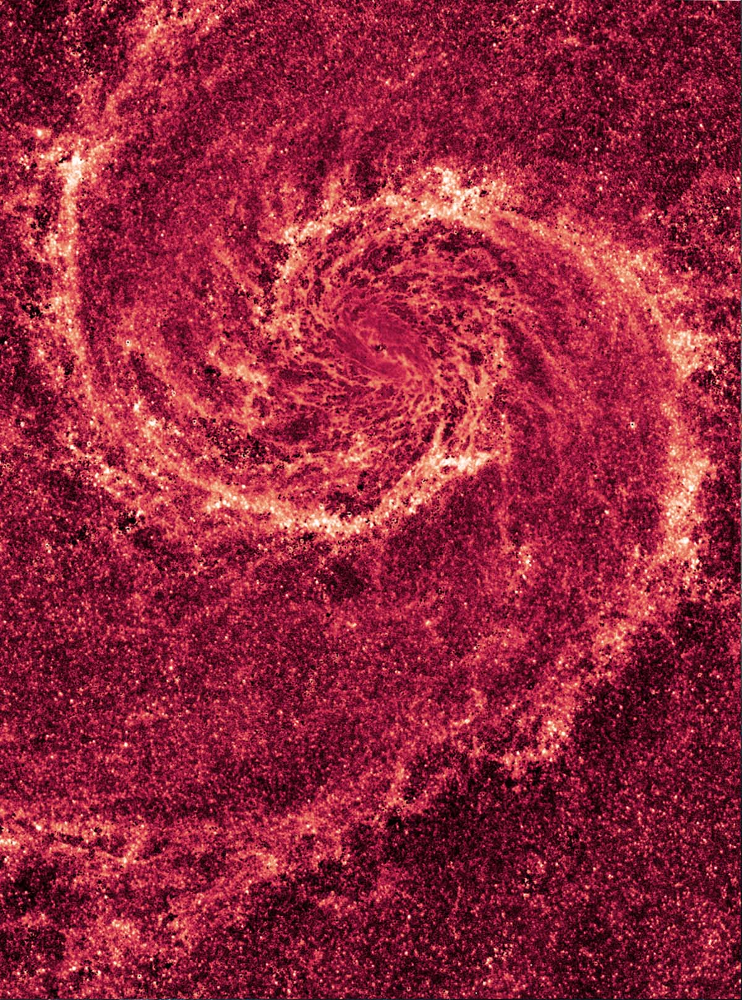

# This is Jeff's awesome website


Here's some text. I like the internet. I use [google](https://www.google.com/) all the time to do data science.


This is what Hubble Space Telescope saw on my birthday. The image reveals the Whirlpool galaxy's skeletal dust structure, as seen in infrared light. You can visit [nasa.gov](https://www.nasa.gov/content/goddard/what-did-hubble-see-on-your-birthday) to check yours.




```{r}
library(tidyverse)

sample = rnorm(1000)
mean(sample)
```

Here's a direct link to the about page: [about](about.html).

I aosl made a bonus [extra page](extra_page.html).